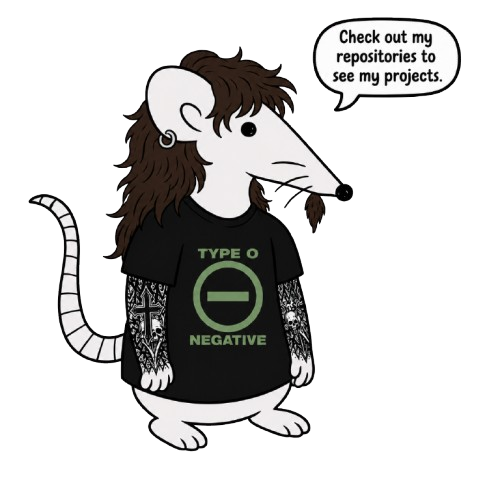
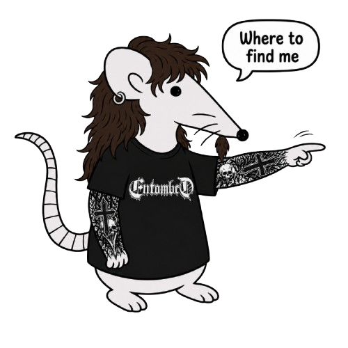

<!-- LINHA 1: Banner 1 (topo esquerdo) -->

  

<!-- LINHA 2: Banner3 (rato) na ESQUERDA e Ícones na DIREITA -->
<table>
  <tr>
    <td width="50%" align="left">
      
    </td>
    <td width="50%" align="right">
      
      
    </td>
  </tr>
</table>

<!-- LINHA 3: Banner2 (esquerda) + LinkedIn (direita, ao lado) -->
<table>
  <tr>
    <td width="70%" align="left">
      
    </td>
    <td width="30%" align="left">
      
    </td>
  </tr>
</table>
